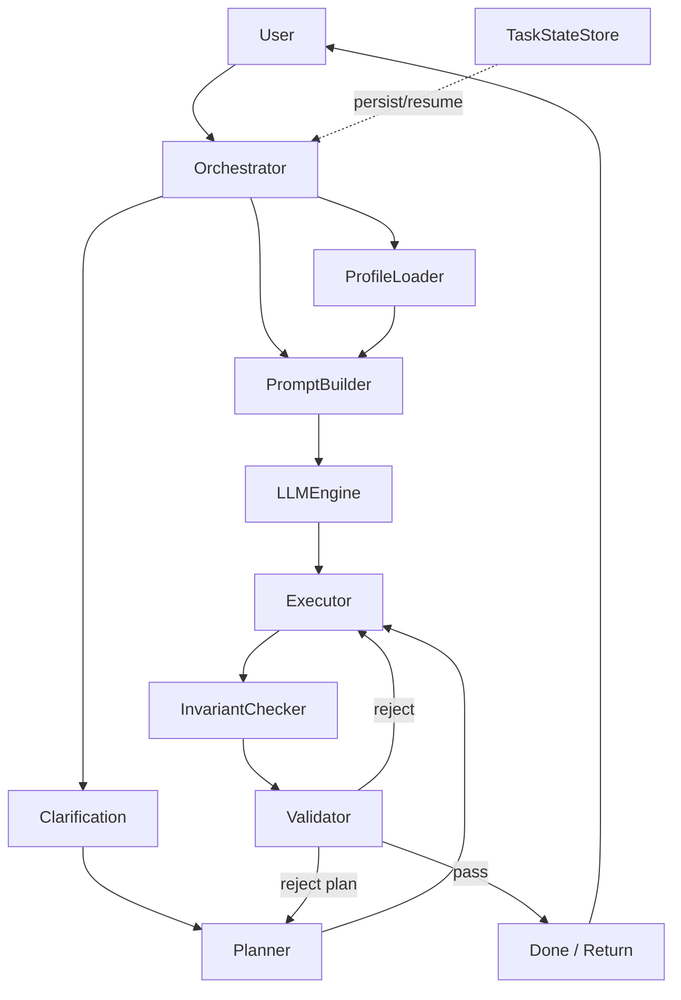
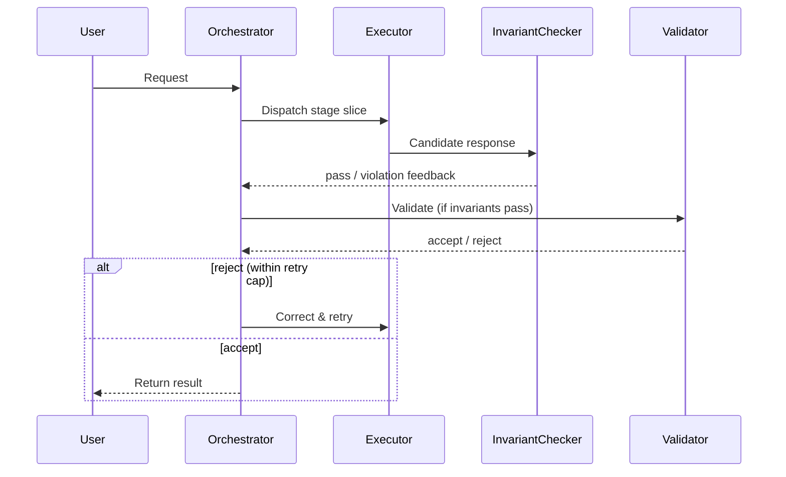
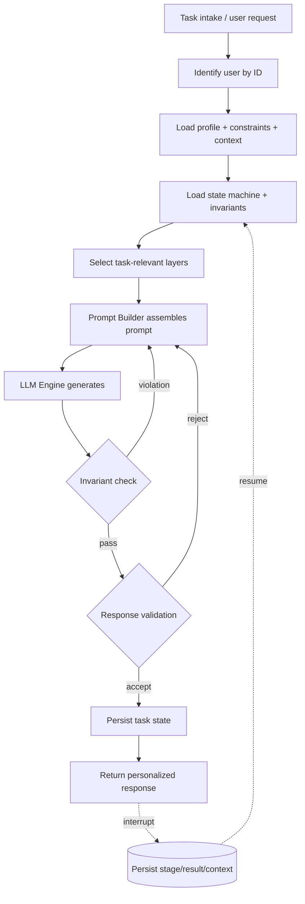

# Stateful Agent — Technical Architecture Document

> Derived from the Week 3 transcript ("Memory and Assistant State"). Markers:
> **[FACT]** stated in transcript · **[INFERENCE]** logically derived · **[RECOMMENDATION]** proposed for refactoring.

---

## 1. Architecture Overview

### System Goals
- **[FACT]** Transform a system of disparate request/response messages into a fully-fledged **stateful agent**.
- **[FACT]** Deliver true personalization: the *same* request yields *different* responses depending on user profile, constraints, and task context.
- **[FACT]** Enforce a controlled, deterministic task process over a non-deterministic LLM.
- **[FACT]** Guarantee invariants (immutable constraints) that survive across requests and sessions.
- **[FACT]** Allow tasks to be paused and resumed (persistence across sessions, outages, token exhaustion).
- **[INFERENCE]** Differentiate a specialized service from "reselling someone else's tokens" via personalization + precise, constrained interaction.

### Architectural Style
- **[INFERENCE]** Layered, interface-driven (SOLID, dependency-injected) agent core with a **finite state machine** governing task lifecycle.
- **[FACT]** Determinism is enforced in **code**, not prompt text, for hard rules (transitions, invariants).
- **[FACT]** Model-agnostic: a pluggable LLM engine abstraction lets OpenAI / DeepSeek / GigaChat / others be injected.
- **[INFERENCE]** Hybrid control: prompt-level guidance (soft) + code-level validation (hard) = "double protection".

### Major Subsystems
**[FACT]** (Section 13 explicitly lists these abstractions):
1. **LLM Engine interface** — provider-agnostic model access.
2. **Prompt Builder** — assembles layered prompt from selected context blocks.
3. **Profile / Personalization Storage** — per-user profile (style, constraints, context).
4. **Task State Storage** — task definition, current stage, plan, results, persistence.
5. **Invariant Checker** — deterministic constraint validation (`check` interface).
6. **Response Validator** — validates LLM output, triggers retry/correction.

### Execution Flow
**[FACT]** (Section 13, console agent in persistent input mode):
1. Receive user request → 2. Load profile → 3. Load state machine → 4. Load invariants → 5. Select context relevant to *this* task → 6. Build prompt → 7. Send to LLM → 8. Validate response → 9. On violation, retry/request correction → 10. On pass, return to user.

---

## 2. Agent Ecosystem

> **[INFERENCE]** The transcript describes one composite stateful agent with internally separable stages. Stages **[FACT]** "can be separated not only by prompts but also at the execution level: different functions, LLM sessions, processes, Docker containers, separate isolated agents." Below, each stage/role is modeled as a first-class agent for refactoring purposes.

### Agent: Onboarding / Interview Agent
- **Purpose** — **[FACT]** Collect personalization on first contact with a new user.
- **Responsibilities** — **[FACT]** Detect new user ID; interview for style, constraints, context/purpose, important technologies; persist the profile.
- **Inputs** — **[FACT]** New user/Telegram ID, user answers.
- **Outputs** — **[FACT]** Persisted profile (style / constraints / context).
- **Dependencies** — Profile Storage. **[INFERENCE]** LLM Engine for conducting the interview.
- **Failure Modes** — **[INFERENCE]** Incomplete/skipped interview → degraded personalization; misclassified user ID → wrong profile loaded.
- **Success Criteria** — **[INFERENCE]** Complete profile stored, keyed by user ID.

### Agent: Personalization / Profile Loader
- **Purpose** — **[FACT]** Make the same request produce user-specific responses.
- **Responsibilities** — **[FACT]** Identify user by ID; retrieve profile, restrictions, relevant context; mix into prompt.
- **Inputs** — **[FACT]** User ID, storage handle.
- **Outputs** — **[FACT]** Profile blocks (style/constraints/context) for the Prompt Builder.
- **Dependencies** — Profile Storage, Prompt Builder.
- **Failure Modes** — **[FACT]** Anti-pattern: loading *all* profiles into every request → noise/conflict (e.g., programming + English-learning modes at once).
- **Success Criteria** — **[INFERENCE]** Only task-relevant profile slices injected.

### Agent: Orchestrator (State Machine Controller)
- **Purpose** — **[FACT]** Move a task through a controlled process via allowed transitions.
- **Responsibilities** — **[FACT]** Track current stage; permit only allowed transitions; forbid stage-skipping; persist/resume task state.
- **Inputs** — **[FACT]** Task object (definition, data, stage, allowed transitions, stage I/O), user request, profile.
- **Outputs** — **[FACT]** Next-stage dispatch with stage-specific task slice; updated task state.
- **Dependencies** — Task State Storage, all stage agents, Invariant Checker, Validator.
- **Failure Modes** — **[FACT]** If transitions are not validated in code, the LLM "tries to help" and skips steps on user request.
- **Success Criteria** — **[FACT]** Adds determinism to a non-deterministic agent; only valid transitions occur.

### Agent: Clarification / Task-Intake Agent
- **Purpose** — **[FACT]** Collect and clarify the task (first basic stage).
- **Responsibilities** — **[FACT]** Gather requirements; **[FACT]** ask predefined questions before implementation.
- **Inputs** — User request, profile. **Outputs** — Structured task definition.
- **Dependencies** — Profile, Task State Storage.
- **Failure Modes** — **[INFERENCE]** Under-clarification → planning on wrong assumptions.
- **Success Criteria** — **[INFERENCE]** Task fields populated; ready to plan.

### Agent: Planner
- **Purpose** — **[FACT]** Produce an approvable plan before execution.
- **Responsibilities** — **[FACT]** Generate plan; **[FACT]** require approval before code; expandable into requirements / approach discussion / decision consultation.
- **Inputs** — Clarified task, profile, invariants. **Outputs** — Approved plan stored in task state.
- **Dependencies** — Orchestrator, Task State Storage.
- **Failure Modes** — **[FACT]** Skipping the plan on user demand (must be refused per state rule).
- **Success Criteria** — **[FACT]** Plan exists and is approved before transition to execution.

### Agent: Executor
- **Purpose** — **[FACT]** Perform the planned work.
- **Responsibilities** — **[FACT]** Execute current stage only (not the whole task); expandable into backend / frontend / testing / review / rework sub-stages.
- **Inputs** — **[FACT]** Only the specific task slice for this stage (not the full plan), plus profile/invariants.
- **Outputs** — Stage result, persisted to task state.
- **Dependencies** — Orchestrator, Invariant Checker, Validator.
- **Failure Modes** — **[INFERENCE]** Producing output violating invariants → bounced back for correction.
- **Success Criteria** — **[INFERENCE]** Output passes invariant + validation checks.

### Agent: Invariant Checker
- **Purpose** — **[FACT]** Deterministically enforce constraints that must not change request-to-request.
- **Responsibilities** — **[FACT]** Hold an invariant list; filter LLM responses; pass if no violation; on violation, return feedback "response does not meet invariants X, rewrite."
- **Inputs** — **[FACT]** Invariant list + candidate response.
- **Outputs** — **[FACT]** Pass / violation-with-feedback.
- **Dependencies** — Invariant store; called by Orchestrator/Validator.
- **Failure Modes** — **[FACT]** Invariants kept in text only can be ignored by the model → must be code-checked.
- **Success Criteria** — **[FACT]** "Like a linter, but for requirements in human language."

### Agent: Response Validator
- **Purpose** — **[FACT]** Validate stage output before returning to user / advancing.
- **Responsibilities** — **[FACT]** Validate response; on violation retry or request correction; expandable to automated tests, code review, end-to-end (browser/Playwright).
- **Inputs** — Candidate response, invariants, stage criteria.
- **Outputs** — Accept (advance/return) / reject (retry).
- **Dependencies** — Invariant Checker, LLM Engine, Orchestrator.
- **Failure Modes** — **[INFERENCE]** Infinite retry if no retry cap; false-pass if criteria weak.
- **Success Criteria** — **[FACT]** No violations → stage successful.

---

## 3. Agent Interaction Architecture

- **Orchestration model** — **[INFERENCE]** Centralized orchestrator driving a finite state machine; stages dispatched sequentially with code-enforced transition guards.
- **Communication patterns** — **[INFERENCE]** Orchestrator ↔ stage agents via task object + stage-specific slices; validation results returned to orchestrator for routing.
- **Dependency graph** — **[INFERENCE]** All stages depend on shared subsystems (Profile, Task State, Invariant Checker, Prompt Builder, LLM Engine).
- **Handoff mechanisms** — **[FACT]** Each stage receives only its own task, not the whole plan; **[FACT]** optional isolation via separate functions/sessions/processes/containers.
- **Coordination strategy** — **[FACT]** Allowed-transition list enforced in code adds determinism; **[FACT]** validation gate between execution and completion.

---

## 4. Memory Architecture

### Memory Types
- **Short-term / session memory** — **[FACT]** Local message history within a session; **[FACT]** easily lost after compression or new session.
- **Long-term memory** — **[FACT]** Persistent accumulation of interaction history and global constraints (absent in stateless agents).
- **Working memory (layered context)** — **[FACT]** "Stores context in layers"; **[FACT]** selectively assembled per task.
- **Profile memory (semantic, per-user)** — **[FACT]** Style + Constraints + Context, keyed by user ID.
- **Invariant memory** — **[FACT]** Immutable cross-request constraints.
- **Task state memory (episodic)** — **[FACT]** Stage, result, current context, user requests, profile snapshot persisted for resume.
- **Summary memory** — **[FACT]** Compressed summary of previous step/session injected into the new system prompt.
- **[INFERENCE]** No explicit vector/semantic-retrieval memory is mandated, though **[FACT]** vector storage is named as one storage option.

### Memory Lifecycle
- **Creation** — **[FACT]** Profile created at onboarding interview; task state created at task start.
- **Update** — **[FACT]** Task state updated at each stage; **[FACT]** summary regenerated after compaction.
- **Retrieval** — **[FACT]** Before each interaction: identify user by ID → retrieve profile, restrictions, relevant context → inject into prompt.
- **Pruning** — **[FACT]** Anti-pattern to stuff everything into every prompt → split into layers; load only what the task needs.
- **Consolidation** — **[FACT]** Summarization compresses prior session into a summary block; **[FACT]** open question of whether profile must be re-added or summary suffices.

### Memory Access Rules
- **Read** — **[INFERENCE]** All stage agents read selected layers via Prompt Builder.
- **Write** — **[INFERENCE]** Onboarding writes profile; Orchestrator/stages write task state; summarizer writes summary.
- **Permission boundaries** — **[FACT]** Invariants are immutable (request-to-request); **[INFERENCE]** profile is user-owned and stable; task state is orchestrator-owned.
- **Conflict resolution** — **[FACT]** Conflicts arise between profile, summary, and current rules; **[FACT]** invariants override user wishes (a prohibited-stack request "shouldn't be passed"); **[RECOMMENDATION]** precedence order: Invariants > System rules > Current task rules > Profile > Summary > Session history.

### Recommended Memory Layer
**[RECOMMENDATION]**
- Storage abstraction with adapters (Markdown / DB / vector / local files) behind a `ProfileStore` and `TaskStateStore` interface.
- Profile layout: `profiles/<user_id>/{style.md, constraints.md, context.md}`.
- Context assembler that, per stage, selects only the required layers (profile slice, invariants, summary, stage rules).
- Summary regenerated on compaction; precedence resolver applies the override order above.

---

## 5. State Management Model

### State Categories
- **[FACT]** Task stages: `clarification` → `planning` → `execution` → `validation` → `done`.
- **[FACT]** Expandable sub-states: planning (requirements / approach / consultation); execution (backend / frontend / testing / review / rework); validation (auto-tests / code review / e2e).

### State Transitions
**[FACT]** (example allowed set):
- `planning → execution`
- `execution → validation | planning`
- `validation → execution | done`

### Persistence Rules
- **[FACT]** On interruption (closed machine, lost connection, timeout, token exhaustion), persist: stage, result, current context, user requests, profile.
- **[FACT]** Restore by feeding saved state back to the model to resume ("we did this, let's continue").

### Recovery Mechanisms
- **[FACT]** Reload full task state after arbitrary delay (e.g., 12 hours) and continue.
- **[FACT]** Validation failure → return to execution (or planning) rather than aborting.

### Recommended State Machine
**[RECOMMENDATION]** Enforce transitions in code (a guarded transition table); reject illegal transitions including user-requested stage-skips.

```mermaid
stateDiagram-v2
    [*] --> Clarification
    Clarification --> Planning
    Planning --> Execution
    Execution --> Validation
    Execution --> Planning
    Validation --> Execution
    Validation --> Done
    Done --> [*]
    note right of Planning: Plan must be approved\nbefore Execution
    note right of Execution: Persist on interrupt;\nresume from saved stage
```

---

## 6. Validation Architecture

### Validation Stages
**[FACT]** Validation is a first-class stage; expandable into automated tests, code review, and end-to-end (browser/Playwright).

**Stage A — Invariant Check**
- Purpose — **[FACT]** Enforce immutable constraints (stack, prohibited tech, budget, etc.).
- Inputs — **[FACT]** Invariant list + candidate response. Outputs — **[FACT]** pass / violation feedback.
- Pass — **[FACT]** No invariant violated. Fail — **[FACT]** Any violation → "rewrite to meet invariants X."

**Stage B — Response Validation**
- Purpose — **[FACT]** Confirm stage output is acceptable before advancing.
- Inputs — Candidate response + stage criteria. Outputs — accept/reject.
- Pass — **[FACT]** No violations → stage successful. Fail — **[FACT]** Retry or request correction.

**Stage C (expanded) — Automated tests / code review / e2e**
- **[FACT]** Named as validation options; **[INFERENCE]** plug-in validators behind the Validator interface.

### Independent Validation Agents
- **[INFERENCE]** Model = **deterministic code-based self/gate review** (linter-style invariant check + response validator), not peer/adversarial/consensus/voting/judge-model.
- **[FACT]** Explicit principle: don't rely on the LLM to police itself in prompt text — "double protection" with code validation.
- **[RECOMMENDATION]** For higher assurance, add an independent **Critic/Judge** agent (separate LLM session) for subjective quality, escalating to human approval on repeated failure. *(beyond transcript)*

**Validator (Invariant Checker + Response Validator)**
- Responsibilities — **[FACT]** Filter output, return actionable feedback, gate stage completion.
- Evaluation criteria — **[FACT]** Invariant list; stage pass criteria.
- Escalation rules — **[FACT]** On violation, retry/correction; **[FACT]** at minimum emit a warning if an invariant is ignored.
- Failure handling — **[FACT]** Loop back to execution/planning.

### Multi-Agent Quality Assurance Pipeline
**[FACT]/[INFERENCE]** reconstruction:
1. Clarification produces task definition. **[FACT]**
2. Planner produces approved plan. **[FACT]**
3. Executor performs the stage. **[FACT]**
4. Invariant Checker filters output (code-level). **[FACT]**
5. Response Validator accepts or rejects. **[FACT]**
6. On reject → retry/correction (loop to execution, or planning). **[FACT]**
7. On accept → done / return to user. **[FACT]**

- Approval thresholds — **[FACT]** Zero invariant violations to pass.
- Retry policy — **[FACT]** Retry/correction on failure; **[RECOMMENDATION]** cap retries (e.g., N=3) then escalate.
- Re-planning trigger — **[FACT]** `validation → planning` / `execution → planning`.
- Escalation — **[FACT]** Warning when invariant ignored; **[RECOMMENDATION]** human-in-the-loop after retry cap.

---

## 7. Execution Pipeline (End-to-End)

**[FACT]** (Sections 8 + 13 combined):

- **[FACT]** Prompt blocks: general system prompt; personalization; previous summary; current-task rules; constraints/invariants; current state; current plan; allowed actions for the step; prohibition to skip stages.

---

## 8. Failure Recovery Strategy

- **Validation failures** — **[FACT]** Retry / request correction; loop to execution or planning. **[RECOMMENDATION]** bounded retries + escalation.
- **Hallucination detection** — **[FACT]** Hallucinations/variability persist; **[INFERENCE]** invariant + validation gates constrain damage. **[RECOMMENDATION]** add fact/criteria checks per stage.
- **Memory conflicts** — **[FACT]** Profile vs summary vs current rules conflict; **[RECOMMENDATION]** precedence resolver (Invariants > rules > task rules > profile > summary > history).
- **Inconsistent state** — **[FACT]** Code-enforced transition table prevents illegal states.
- **Agent disagreement** — **[INFERENCE]** Not addressed; **[RECOMMENDATION]** Orchestrator is the single arbiter; optional Critic with tie-break to human.
- **Timeout / token exhaustion** — **[FACT]** Persist full task state and resume later.
- **Retry strategy** — **[FACT]** Retry on violation; **[RECOMMENDATION]** exponential/bounded retries, then warn/escalate.

---

## 9. Refactoring Implications

### R1 — Introduce code-enforced state machine
- **Problem** — **[FACT]** Prompt-only transition rules get lost after summarization/compaction/window exit/conflicting instructions.
- **Evidence** — §9.3, §12.2.
- **Proposed refactoring** — Guarded transition table in code; reject illegal/skip transitions.
- **Expected benefit** — Determinism over a non-deterministic model.
- **Complexity** — Medium.

### R2 — Invariant Checker as a linter for NL requirements
- **Problem** — **[FACT]** Text-only invariants are ignorable.
- **Evidence** — §11.1, §12.3.
- **Proposed refactoring** — `Invariant` interface with `check()`; pipeline filter + feedback loop; double protection (prompt + code).
- **Expected benefit** — Hard, auditable constraint enforcement.
- **Complexity** — Medium.

### R3 — Layered context assembly via Prompt Builder
- **Problem** — **[FACT]** Stuffing everything into every prompt causes overflow/noise/mode conflicts.
- **Evidence** — §12.1, §7.
- **Proposed refactoring** — Per-stage context selector choosing only needed layers.
- **Expected benefit** — Cleaner prompts, less drift, lower cost.
- **Complexity** — Low–Medium.

### R4 — Task persistence & resume
- **Problem** — **[FACT]** Work lost on interruption; general tools don't auto-store workflow.
- **Evidence** — §10.
- **Proposed refactoring** — `TaskStateStore` snapshotting stage/result/context/profile; resume loader.
- **Expected benefit** — Robust long-running tasks; differentiation vs generic assistants.
- **Complexity** — Medium.

### R5 — Personalization profile per user ID
- **Problem** — **[FACT]** Stateless agents give the same generic answer to everyone.
- **Evidence** — §2, §5, §8.
- **Proposed refactoring** — Onboarding interview + `ProfileStore` (style/constraints/context) injected per session.
- **Expected benefit** — True personalization; service value.
- **Complexity** — Low–Medium.

### R6 — Provider-agnostic abstractions (SOLID/DI)
- **Problem** — **[FACT]** Lock-in to one model; maintainability.
- **Evidence** — §13.
- **Proposed refactoring** — Interfaces: LLM Engine, Prompt Builder, Profile Store, Task State Store, Invariant Checker, Validator; inject concrete providers.
- **Expected benefit** — Swappable models, easy edits, small codebase.
- **Complexity** — Medium.

### R7 — Optional execution-level stage isolation
- **Problem** — **[FACT]** Prompt-only stage separation is weak.
- **Evidence** — §9.5.
- **Proposed refactoring** — Separate functions/sessions/processes/containers per stage; give each only its slice.
- **Expected benefit** — Stronger determinism/containment.
- **Complexity** — High.

---

## 10. Architecture Decisions (ADR Candidates)

### ADR-001 — Code-enforced task state machine
- **Context** — **[FACT]** LLMs violate prompt rules after compaction/conflicts.
- **Decision** — Enforce allowed transitions in code; forbid stage-skipping.
- **Consequences** — Deterministic flow; added orchestration code; must maintain transition table.
- **Alternatives** — Prompt-only rules (**[FACT]** lossy, rejected).

### ADR-002 — Invariants enforced in code, not text
- **Context** — **[FACT]** Text invariants are instructions that can be broken.
- **Decision** — `check()`-based Invariant Checker filters every response; prompt invariants kept as soft backup.
- **Consequences** — Reliable constraints; need to express invariants programmatically.
- **Alternatives** — Prompt-only invariants (rejected); warning-only (**[FACT]** acceptable minimum).

### ADR-003 — Layered, selective context assembly
- **Context** — **[FACT]** All-in-one prompts overflow and conflict.
- **Decision** — Prompt Builder selects only task-relevant layers.
- **Consequences** — Lower noise/cost; selection logic to maintain.
- **Alternatives** — Always inject all memory (**[FACT]** anti-pattern).

### ADR-004 — Task persistence and resume
- **Context** — **[FACT]** Interruptions lose work.
- **Decision** — Persist full task state; resume by replaying into model.
- **Consequences** — Durable long tasks; storage + serialization needed.
- **Alternatives** — Session-only memory (**[FACT]** stateless weakness).

### ADR-005 — Per-user personalization profile
- **Context** — **[FACT]** Generic answers lack value.
- **Decision** — Onboarding interview + per-ID profile injected into context.
- **Consequences** — Differentiated responses; profile lifecycle to manage.
- **Alternatives** — No profile (rejected).

### ADR-006 — Provider-agnostic interface architecture
- **Context** — **[FACT]** Avoid model lock-in; maintainability.
- **Decision** — SOLID interfaces with injected providers.
- **Consequences** — Swappable models; abstraction overhead.
- **Alternatives** — Direct provider coupling (rejected).

### ADR-007 — Invariants override user requests
- **Context** — **[FACT]** Users may request prohibited stacks; LLM tends to comply.
- **Decision** — Refuse-and-offer-alternative when a request violates invariants.
- **Consequences** — Business rules protected; requires graceful refusal UX.
- **Alternatives** — Honor user wish (**[FACT]** rejected).

---

## 11. Open Questions

- **Profile vs summary duplication** — **[FACT]** Should the profile be re-added each session or does the summary (with stack/prior inputs) suffice? *Matters:* token cost vs personalization fidelity. *Follow-up:* measure drift with/without re-injection.
- **Conflict precedence** — **[FACT]** How are profile/summary/current-rule conflicts resolved? *Matters:* correctness of behavior. *Follow-up:* formalize precedence resolver (proposed in §4).
- **Retry bounds** — **[INFERENCE]** No retry cap specified. *Matters:* prevents infinite loops/cost. *Follow-up:* define N + escalation.
- **Independent reviewer** — **[INFERENCE]** No judge/critic specified. *Matters:* subjective quality beyond invariants. *Follow-up:* evaluate LLM-judge or human gate.
- **Isolation level** — **[FACT]** Functions vs sessions vs containers left open. *Matters:* cost/complexity vs determinism. *Follow-up:* decide per stage criticality.
- **Storage backend** — **[FACT]** Markdown/DB/vector/local all named. *Matters:* scale, retrieval. *Follow-up:* pick per deployment.

---

## 12. Final Refactoring Blueprint

### Target Architecture
**[RECOMMENDATION]** A small, interface-driven stateful-agent core: Orchestrator drives a code-enforced FSM; each stage uses a Prompt Builder that assembles selected memory layers; outputs pass through Invariant Checker + Validator gates; task state is persisted for resume; model access is abstracted behind an LLM Engine.

### Core Components
- LLM Engine (provider adapters)
- Prompt Builder (layer selector)
- Profile Store (per-user style/constraints/context)
- Task State Store (stage/plan/result/context, persist+resume)
- Invariant Checker (`check()` filter)
- Response Validator (pluggable: tests/review/e2e)
- Orchestrator (FSM + transition guards)

### Agent Topology
**[RECOMMENDATION]** Orchestrator → {Clarification, Planner, Executor} stages → {Invariant Checker → Validator} gate → Done. Profile Loader + Prompt Builder serve all stages. (Diagram §3.)

### Memory Topology
**[RECOMMENDATION]** Invariants (immutable) · Profile (per-user, stable) · Task State (episodic, persisted) · Summary (consolidated) · Session history (volatile). Precedence: Invariants > System rules > Task rules > Profile > Summary > History.

### Validation Topology
**[RECOMMENDATION]** Gate 1: code invariant check (hard). Gate 2: response validation (stage criteria; optional tests/review/e2e). Failure → bounded retry → re-plan → escalate.

### Migration Strategy
- **Phase 1 (Low–Med)** — Extract interfaces (LLM Engine, Prompt Builder, stores); add per-user Profile Store + onboarding; layered prompt assembly. *(R3, R5, R6)*
- **Phase 2 (Med)** — Implement code-enforced FSM + Orchestrator; task persistence/resume; Invariant Checker with `check()` + feedback loop. *(R1, R2, R4)*
- **Phase 3 (Med–High)** — Pluggable Validators (tests/review/e2e); optional execution-level stage isolation; bounded-retry + escalation/critic. *(R7, open questions)*

### Risks
- **[FACT]** Practice reveals unforeseen complexity/under-estimation — schedule iteration.
- **[INFERENCE]** Over-injection regressions; transition-table maintenance burden; retry loops without caps; storage/backend choice affecting scale.

### Success Metrics
**[INFERENCE]/[RECOMMENDATION]**
- Zero invariant violations in returned outputs.
- Same-request divergence across distinct profiles (personalization proven).
- Successful pause/resume across sessions.
- No illegal state transitions / no unauthorized stage-skips.
- Bounded retry counts; reduced prompt size/cost vs all-in-one baseline.
