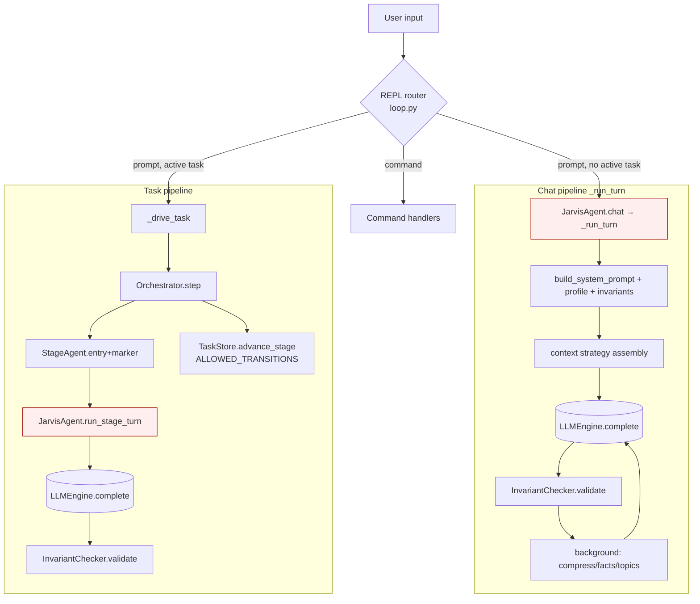
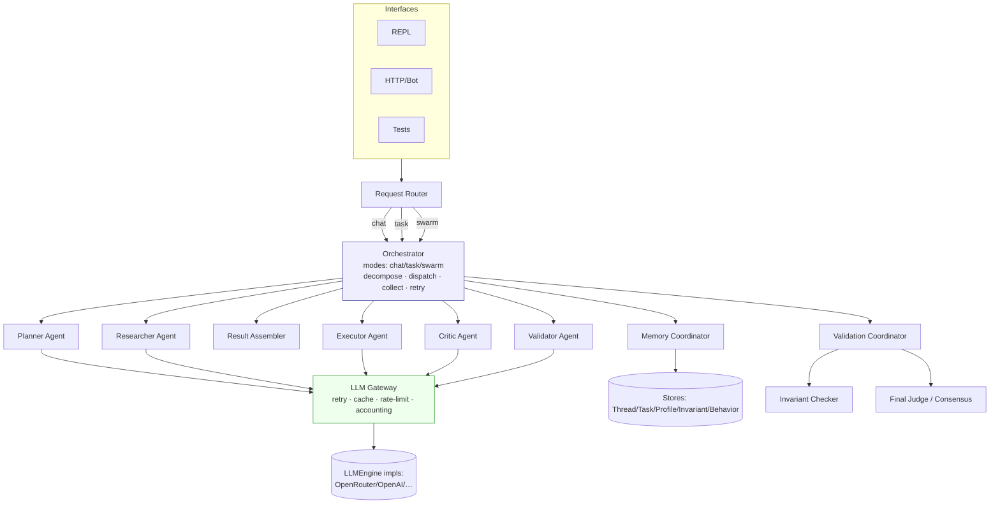
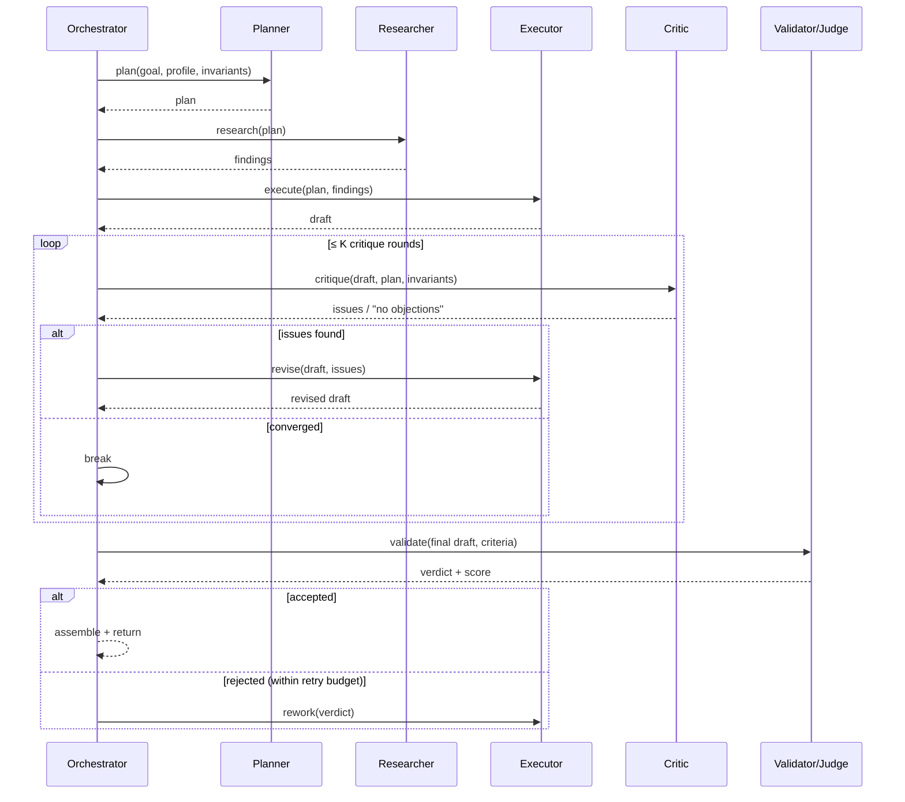
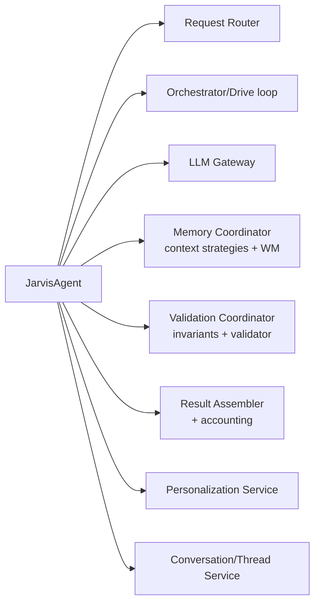
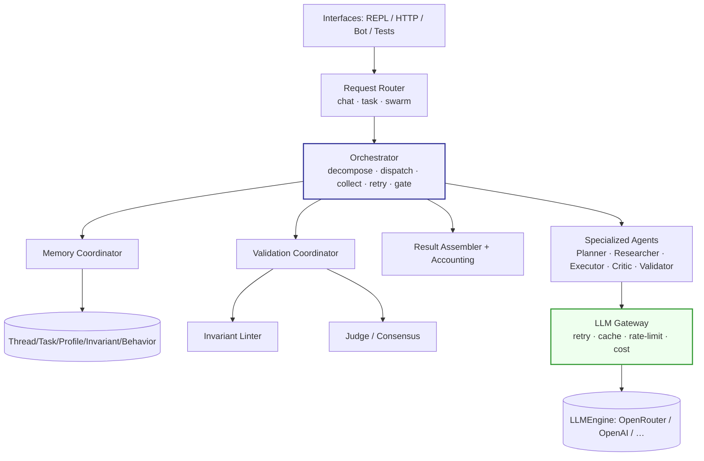

# Jarvis CLI — Architecture Audit

> Principal-architect review of the current implementation against `03-architecture-document.md` (the desired vision). Scope: architecture, agent topology, orchestration, memory, state, validation, scalability, extensibility, maintainability. Code style is out of scope.
>
> Files reviewed: `jarvis/agent.py`, `jarvis/pipeline/{orchestrator,stages,base,invariants}.py`, `jarvis/llm/engine.py`, `jarvis/openrouter/client.py`, `jarvis/prompt_builder/builder.py`, `jarvis/session/{task,profile,invariant,thread}_store.py`, `jarvis/repl/loop.py`.

---

## Executive Summary

The codebase is **better than the average LLM-CLI hobby project**: it has a genuine code-enforced FSM, a clean per-stage agent contract, a provider-agnostic `LLMEngine` Protocol, and a dedicated invariant validator. The *task pipeline* subsystem is close to the spec.

The problem is **everything that is not the task pipeline lives inside `JarvisAgent`** — an 827-line class that is the conversation owner, the LLM gateway, the memory manager (5 context strategies + summarization + facts + topic routing), the thread/task lifecycle manager, the personalization engine, and the billing/accounting subsystem. It is the canonical God Object. The system also runs **two parallel, partially-duplicated execution pipelines** (chat vs. task) with no unifying orchestration layer, and there is **no foundation for a multi-agent swarm**: stage agents cannot talk to the LLM themselves, the orchestrator runs exactly one agent per stage sequentially, and there is no independent/peer/consensus validation.

| Dimension | Score (0–10) | One-line justification |
|---|---|---|
| **Overall architecture** | **6** | Strong pipeline + abstractions, undermined by a God agent and a forked dual-mode pipeline. |
| **Maintainability** | **5** | `agent.py` mixes 6+ responsibilities; the pipeline package, by contrast, is clean and testable. |
| **Extensibility** | **5** | Trivial to add a stage agent or context strategy; very hard to add an autonomous/independent agent. |
| **Swarm-readiness** | **2** | No independent LLM access for agents, no fan-out/collect orchestrator, no inter-agent messaging. |
| **Validation-readiness** | **4** | Has an invariant linter + a validation stage; no independent, adversarial, or consensus validation. |

**Verdict up front:** Refactor — but surgically, not a rewrite. The pipeline package is the seed of the target architecture. The work is (1) decompose `JarvisAgent`, (2) promote a single `Orchestrator`/`LLMGateway` layer that both modes share, (3) give agents first-class LLM access so a swarm becomes possible.

---

## Current Architecture Reconstruction

### Components

| Layer | Component | File | Role |
|---|---|---|---|
| UI | `run_repl` / `_drive_task` | `repl/loop.py` | Reads input, **routes chat vs. task**, renders gates/progress. |
| Facade / God object | `JarvisAgent` | `agent.py` | Owns history, memory strategies, LLM calls, personalization, accounting, lifecycle. |
| Orchestration | `Orchestrator` | `pipeline/orchestrator.py` | Runs one FSM stage per `step()`; auto-advances or stops at a gate. |
| Agents | `StageAgent` subclasses | `pipeline/stages.py` | Clarifier, Planner, Executor, Validator, Done. |
| Validator | `InvariantChecker` | `pipeline/invariants.py` | Per-turn NL "requirements linter" (separate LLM call). |
| Abstraction | `LLMEngine` (Protocol) | `llm/engine.py` | Provider contract; `OpenRouterClient` is the impl. |
| Prompt | `prompt_builder` | `prompt_builder/builder.py` | System-prompt assembly, WM block, all strategy/check prompts. |
| Persistence | `*Store` | `session/*.py` | Thread, Task, Profile, Invariant, Behavior, Session repositories. |

### Agents
- **Stage agents** (real, well-formed): `ClarifierAgent`, `PlannerAgent`, `ExecutorAgent`, `ValidatorAgent`, `DoneAgent` — each with `input_ready` (input contract), `system_fragment` (role), `marker_protocol` (output contract), `interpret`/`record`.
- **Cross-cutting validator**: `InvariantChecker` (not a stage; runs every turn in *both* modes).
- **No** Research agent, Critic agent, Memory agent, or Judge/Orchestrator *agent* (the orchestrator is a controller class, not an LLM agent).

### Services
- Memory/context services are **methods on `JarvisAgent`**, not separate services: `_build_compressed_context`, `_maybe_compress`, `_update_facts`, `_route_to_topic`, `_update_topic_summary`, `_generate_summary`. This is the core smell.
- Personalization service: `propose_profile_style` / `apply_profile_style` / `_maybe_profile_nudge` — also on `JarvisAgent`.

### Repositories
`ThreadStore`, `TaskStore` (owns `ALLOWED_TRANSITIONS` + `advance_stage` — the FSM source of truth), `ProfileStore`, `InvariantStore`, `BehaviorLog`, `SessionStore`. Clean, file-backed, home-dir resolved at instantiation for test isolation. This layer is healthy.

### Execution Flow

The two red nodes are the duplicated LLM-call sites inside `JarvisAgent`; the two blue nodes are the two independent entry points to the same `LLMEngine` — there is no single gateway.

---

## Architecture Compliance Analysis

Compared against `03-architecture-document.md` (the generated spec).

| Requirement (spec) | Implemented | Partial | Missing | Notes |
|---|:---:|:---:|:---:|---|
| LLM Engine interface (provider-agnostic) | ✅ | | | `LLMEngine` Protocol; `OpenRouterClient` satisfies structurally. |
| Prompt Builder (layered assembly) | ✅ | | | `build_system_prompt` assembles base→strategy→profile→invariants→stage. |
| Profile Store (style/constraints/context) | | ⚠️ | | Single **global** `profile.md`, not per-user-ID (spec §4 assumes per-user keying). Single-user only. |
| Task State Store + persist/resume | ✅ | | | `TaskStore`, full snapshot, resumable via `task run`. Strong. |
| Code-enforced FSM / transition guards | ✅ | | | `ALLOWED_TRANSITIONS` in `TaskStore.advance_stage`; LLM never self-transitions. Excellent. |
| Invariant Checker (`check()` linter) | ✅ | | | `InvariantChecker` + refuse-and-explain resolution. Matches spec ADR-002/007. |
| Response Validator (pluggable tests/review/e2e) | | ⚠️ | | Only `ValidatorAgent` (LLM self-check) + invariant filter. No tests/e2e/Playwright hooks. |
| Orchestrator (FSM + dispatch) | | ⚠️ | | Exists for **task mode only**; chat mode bypasses it entirely. |
| Onboarding interview | ✅ | | | `run_onboarding` on first run; skippable default. |
| Layered / selective context (anti-"all-in-one") | | ⚠️ | | Chat has 5 strategies + stage-scoped WM block (good); but tasks ignore them and `agent.py` centralizes all of it. |
| Conflict/precedence resolver (invariants>rules>profile…) | | | ❌ | No explicit precedence engine; ordering is implicit in string concatenation order. |
| Bounded retries + escalation | | ⚠️ | | Invariant resolves **once**; driver has `_MAX_DRIVE_TURNS=80` safety cap; no real retry/escalation policy on validation failure. |
| Independent critic / judge agent | | | ❌ | Spec open-question + recommendation; not built. |
| Multi-agent / swarm coordination | | | ❌ | Not supported (see gap analysis). |
| Memory Agent (memory as a coordinated component) | | | ❌ | Memory is `JarvisAgent` internals, not a component/agent. |

**Compliance score ≈ 60%.** The deterministic core (FSM, invariants, engine abstraction, persistence) is implemented well; the coordination, multi-agent, and conflict-resolution layers are absent.

---

## Architectural Smells

### God Objects

**`JarvisAgent` (`agent.py`, 827 lines).**

- **Evidence** — In one class: conversation history ownership; thread CRUD (`new_thread`, `load_thread`, `delete_thread`, `rename_thread`, `reset_history`); task CRUD + pipeline driving (`create_task`…`pipeline_step`, `advance_to`); **direct LLM calls in ≥8 sites** (`_run_turn`, `run_stage_turn`, `_generate_summary`, `_update_facts`, `_route_to_topic`, `_update_topic_summary`, `propose_profile_style`, plus the prompt_generation stage-1); **all 5 context strategies** (`_build_*_context`, `_maybe_compress`, `_run_background_strategy_work`); personalization (`_maybe_profile_nudge`, `propose_profile_style`, `apply_profile_style`); billing/accounting (token/cost aggregation, `_cost_series`); and the invariant orchestration.
- **Impact** — Every new feature touches this file; merge contention; near-impossible to unit-test a single concern in isolation; the chat and task pipelines are coupled through shared private state (`self._active_task`, `self._client`, `self._config`).
- **Severity** — **Critical.**

### Tight Coupling

- **Evidence** — `Orchestrator.step()` takes `run_turn: RunTurn` which is `JarvisAgent.run_stage_turn` — a bound method that itself builds prompts, calls the engine, *and* runs the invariant check. The orchestrator cannot run a stage without `JarvisAgent`. Stage agents never see the `LLMEngine`; they emit a string and receive raw text from a callback they don't control.
- **Impact** — Agents cannot evolve independently; you cannot give one stage a different model, its own tools, or its own retry policy without changing `JarvisAgent`.
- **Severity** — **High.**

### Feature Envy

- **Evidence** — `prompt_builder.build_working_memory_block` and `_preceding_stage_output` reach deep into the `task` dict shape (`stage_outputs`, `plan_steps`, `step_index`, `current_step`). `loop.py._split_summary` parses the Done agent's output format. Knowledge of the task schema is smeared across `task_store`, `stages`, `prompt_builder`, and `loop`.
- **Impact** — A change to task structure ripples through four modules.
- **Severity** — **Medium.**

### Orchestration Leakage

- **Evidence** — Mode routing ("is there an active task? drive the pipeline : call chat") lives in `repl/loop.py` (`run_repl`, `_drive_task`, `_drive_execution`). Gate handling (Confirm/Reject, question loops, retry caps, step-table redraw) is in the **UI layer**. The orchestrator returns a `StageResult` and the *driver in the REPL* decides retries, rework feedback, and advancement application (`agent.advance_to`).
- **Impact** — Business coordination logic is trapped in the terminal UI; a second interface (HTTP, Telegram, tests) must re-implement the entire drive loop. Directly contradicts spec's "unified orchestration layer."
- **Severity** — **High.**

### Responsibility Violations

- **Evidence** — `TaskStore` (a repository) owns `ALLOWED_TRANSITIONS` and the transition-validation logic (`advance_stage`). Persistence and FSM policy are fused. `JarvisAgent.run_stage_turn` both persists task transcript and runs validation.
- **Impact** — FSM policy can't be reused/tested without the file store; the SRP boundary between "what is allowed" and "where state is saved" is blurred.
- **Severity** — **Medium.**

### Hidden Dependencies

- **Evidence** — `prompt_builder.build_system_prompt` does a **lazy import** of `pipeline.stages.stage_system_fragment` inside the function to dodge a module cycle (`stages → base`, `builder` imported widely). Two LLM-call owners (`JarvisAgent`, `InvariantChecker`) each hold their own `engine` reference — there is no single injection point.
- **Impact** — The import cycle signals a layering inversion (prompt builder depends on agent stages). LLM usage can't be globally instrumented (rate-limit, cache, retry) because there's no chokepoint.
- **Severity** — **Medium.**

### State Management Issues

- **Evidence** — Chat state is a wide tuple of ~10 fields unpacked in **four** places (`__init__`, `load_thread`, `delete_thread`, and via `load_last`), each re-listing `_summary, _summary_covered_turns, _facts, _topic_summaries, …`. `_active_task` is mutable shared state read by both pipelines. `expected_action`/`current_step`/`step_index` are duplicated across the task dict and re-derived in several agents.
- **Impact** — Adding one piece of thread state means editing four unpack sites; easy to desync. No single state object.
- **Severity** — **Medium.**

### Memory Layer Problems

- **Evidence** — Context strategies apply **only to chat** (`_build_context`). The **task pipeline sends the task's full raw `messages` history every turn** (`run_stage_turn`) with no compression — long tasks will grow unbounded toward the context limit. The spec's precedence/conflict resolution (§4) is not implemented; layering is implicit in concatenation order in `build_system_prompt`.
- **Impact** — Task mode (the flagship "stateful agent") is the *least* protected against context overflow — the opposite of the spec's intent. No conflict resolution between profile/summary/invariants.
- **Severity** — **High.**

### Validation Gaps

- **Evidence** — Two validators exist: `InvariantChecker` (single-model self-check, resolves **once**) and `ValidatorAgent` (same model validates its own work, then a human gates). No peer review, no independent model, no adversarial critic, no consensus/voting. Validation failure routing (`validation → execution`) is driven by the **human** at a gate, not by an automated judge.
- **Impact** — No defense against a model that is confidently wrong in both generation and self-validation; spec's "5-agent collaborative validation" is unreachable from here.
- **Severity** — **High.**

---

## Swarm Architecture Gap Analysis

Target: `Orchestrator Agent → {Planner, Executor(s), Validator(s), Memory, Final Judge}` collaborating, all comms via the Orchestrator.

### Blocker 1 — Agents have no LLM access of their own
- **Current design** — `StageAgent` is a pure parser/contract object; the LLM call is performed by `JarvisAgent.run_stage_turn` and handed back as a string via the `run_turn` callback.
- **Problem** — A Research or Critic agent must run its *own* model calls (possibly a different model, with tools). It cannot, because LLM access is centralized in the God object.
- **Required refactor** — Inject an `LLMGateway` into each agent (or pass it through the orchestrator). Agents own their own `complete()` calls behind the gateway.
- **Estimated complexity** — **High.**

### Blocker 2 — Orchestrator runs exactly one agent per stage, sequentially
- **Current design** — `Orchestrator.step()` looks up `self._agents[task["stage"]]`, runs it once, advances on a single forward edge.
- **Problem** — A swarm needs fan-out (run Planner + Researcher), collect, and conditional convergence — not a 1:1 stage→agent map.
- **Required refactor** — Introduce a coordination model where the orchestrator dispatches *work items* to N agents and aggregates results, distinct from the linear FSM.
- **Estimated complexity** — **High.**

### Blocker 3 — No inter-agent message bus / shared blackboard
- **Current design** — The only shared state is the `task` dict mutated in place; agents communicate by writing `stage_outputs[stage]`.
- **Problem** — Consensus/critique requires structured exchange (proposal → critique → revision) with provenance, not a flat dict overwrite.
- **Required refactor** — A typed `AgentMessage` channel routed through the orchestrator (spec rule #7: all comms via Orchestrator).
- **Estimated complexity** — **Medium.**

### Blocker 4 — Synchronous, single-threaded driver
- **Current design** — `_drive_task` loops one `pipeline_step` at a time on the main thread (worker thread only animates the spinner).
- **Problem** — Simultaneous agents imply concurrency or at least interleaved async calls; the current loop assumes one in-flight step.
- **Required refactor** — Async orchestrator (`asyncio`) or a task-pool executor; gates become awaited events.
- **Estimated complexity** — **High.**

### Blocker 5 — Coordination logic lives in the UI
- **Current design** — Retry/rework/advancement decisions are in `repl/loop.py`.
- **Problem** — A swarm orchestrator must own these decisions, not the terminal.
- **Required refactor** — Move drive logic into the orchestration layer (see Migration Phase 2).
- **Estimated complexity** — **Medium.**

### Blocker 6 — No judge/critic roles or independent validation primitives
- **Current design** — One `ValidatorAgent`; human-gated.
- **Problem** — Spec's Final Judge and Critic don't exist; no voting/consensus primitive.
- **Required refactor** — Add `CriticAgent`/`JudgeAgent` types and a consensus aggregator.
- **Estimated complexity** — **Medium.**

---

## Recommended Target Architecture

Orchestration-first. One coordination layer serves **Chat**, **Task**, and **Swarm** modes. Agents are specialized, independent, and reach the model only through an `LLMGateway`. All inter-agent communication is mediated by the Orchestrator.

**Key moves vs. today:**
1. **`Request Router`** (extracted from `repl/loop.py`) selects the mode; the REPL becomes pure I/O.
2. **`Orchestrator`** absorbs the drive loop, retries, and mode dispatch. Chat is just a one-stage pipeline; task is the linear FSM; swarm is fan-out/collect — all three reuse the same dispatch/collect machinery.
3. **`LLMGateway`** is the single chokepoint for every model call (today's scattered `complete()` calls + `InvariantChecker` + accounting funnel here).
4. **`Memory Coordinator`** owns the context strategies and the WM block (lifted out of `JarvisAgent`); it serves *both* chat and task, fixing the unbounded-task-history bug.
5. **`Validation Coordinator`** owns the invariant linter + validator + (new) judge/consensus.
6. **Agents** hold a gateway reference and run their own calls — the swarm precondition.

---

## Multi-Agent Consensus Design

Mentor recommendation: 5 agents for important stages, exchanging opinions through the Orchestrator.

### Practical implementation

- Agents: `PlannerAgent`, `ResearcherAgent`, `ExecutorAgent`, `CriticAgent`, `ValidatorAgent`. Each implements `async def contribute(ctx) -> AgentMessage` and holds an `LLMGateway`.
- The Orchestrator owns a `Blackboard` (typed, append-only, provenance-tagged). Agents never call each other; they read the blackboard slice the orchestrator passes and return a message the orchestrator posts.
- Convergence: a bounded **critique loop** — Executor proposes, Critic challenges, Executor revises (max K rounds), then Validator + Judge decide accept/reject. Judge can use either a single stronger model or majority vote across N validators.

### Analysis

| Factor | Assessment |
|---|---|
| **Benefits** | Catches single-model blind spots; Critic + Judge give true independent validation; provenance aids debugging; modular roles. |
| **Costs** | ~4–6× the LLM calls of a single pass; orchestration complexity; prompt-engineering per role. |
| **Token usage** | Each round re-sends context; budget with the Memory Coordinator (summaries, not full transcripts) and cap K (e.g. 2). Expect 5–10× single-agent tokens for a full consensus task. |
| **Latency** | Sequential critique loop dominates. Mitigate by running independent agents (Planner+Researcher) concurrently via the async gateway; keep the critique loop sequential. |
| **Implementation complexity** | High — needs LLMGateway, async orchestrator, blackboard, judge. This is the *last* migration phase, not the first. |

**Recommendation:** make the swarm an opt-in mode behind the same Orchestrator, with K and validator-count configurable, and a hard token budget per task. Do not make it the default.

---

## JarvisAgent Refactoring Strategy

`JarvisAgent` is a God Agent. Decompose it along its current fault lines:

| Extracted component | Absorbs from `agent.py` |
|---|---|
| **LLM Gateway** | All `self._client.complete(...)` sites + `_make_call_record` accounting. |
| **Memory Coordinator** | `_build_*_context`, `_maybe_compress`, `_update_facts`, `_route_to_topic`, `_update_topic_summary`, `_generate_summary`, `build_working_memory_block`. |
| **Conversation/Thread Service** | thread CRUD, history ownership, the 10-field state tuple → a `ThreadState` dataclass. |
| **Validation Coordinator** | `InvariantChecker` wiring + the validation stage. |
| **Personalization Service** | `_maybe_profile_nudge`, `propose_profile_style`, `apply_profile_style`. |
| **Result Assembler** | cost/token aggregation, `_cost_series`, `SessionStore.add`. |
| **Orchestrator** | `pipeline_step`, `advance_to`, the drive loop lifted from `repl/loop.py`. |

**Migration steps for JarvisAgent specifically:**
1. Extract `LLMGateway`; route `InvariantChecker` and all agent calls through it (behavior-preserving).
2. Introduce `ThreadState` dataclass; collapse the 4 tuple-unpack sites into one.
3. Move context strategies into `MemoryCoordinator`; `JarvisAgent` delegates.
4. Move personalization + accounting out.
5. `JarvisAgent` shrinks to a thin facade (or is deleted in favor of the Orchestrator + services).

---

## Migration Plan

### Phase 1 — Minimal-risk consolidation
- **Goals** — Remove duplication and create seams without changing behavior.
- **Changes** — Extract `LLMGateway` (single chokepoint, all `complete()` + accounting); introduce `ThreadState` dataclass; lift `ALLOWED_TRANSITIONS` into a `pipeline/fsm.py` policy object (TaskStore depends on it, not owns it); break the `builder ↔ stages` import cycle by moving stage fragments behind an interface.
- **Risks** — Low; pure refactor. Behavior covered by existing tests (`test_orchestrator`, `test_invariant_checker`, `test_task_store`).
- **Rollback** — Revert per-extraction commits; no data/format changes.

### Phase 2 — Orchestration extraction
- **Goals** — One coordination layer for chat + task; UI becomes pure I/O.
- **Changes** — Move the `_drive_task`/`_drive_execution` drive loop, gate handling, retries, and rework routing from `repl/loop.py` into the `Orchestrator`. Add a `RequestRouter`. REPL calls `orchestrator.handle(input)`.
- **Risks** — Medium; touches the interactive UX. Mitigate with golden-transcript tests on the drive loop before moving it.
- **Rollback** — Keep the old `_drive_task` behind a feature flag for one release.

### Phase 3 — Agent specialization
- **Goals** — Agents gain independent LLM access; chat becomes a one-stage pipeline through the same orchestrator.
- **Changes** — Inject `LLMGateway` into `StageAgent`; agents own their `complete()` calls; remove the `run_turn` callback coupling. Extract `MemoryCoordinator` and make the **task pipeline use context strategies** (fixes unbounded task history).
- **Risks** — Medium-High; changes the agent contract. Add per-agent unit tests with the fake engine.
- **Rollback** — Agents can fall back to a default gateway; keep the callback path until parity is proven.

### Phase 4 — Validation layer
- **Goals** — Independent, automated validation.
- **Changes** — `ValidationCoordinator` hosting the invariant linter + `ValidatorAgent` + a new `CriticAgent` and `JudgeAgent`; bounded retry/escalation policy (replace the implicit "resolve once" / `_MAX_DRIVE_TURNS`); optional pluggable validators (tests, e2e) behind an interface.
- **Risks** — Medium; added token cost. Gate behind config; budget caps.
- **Rollback** — Disable critic/judge via config; revert to single-validator gate.

### Phase 5 — Swarm architecture
- **Goals** — Multi-agent consensus mode.
- **Changes** — Async orchestrator, `Blackboard`, `AgentMessage` bus (all via orchestrator), fan-out/collect dispatch, consensus aggregator. New `swarm` mode in the `RequestRouter`.
- **Risks** — High; concurrency + cost + latency. Ship opt-in, single-task, with hard token budgets.
- **Rollback** — Feature-flagged mode; task and chat modes unaffected.

---

## Final Verdict

### Should the current architecture be refactored?
**Yes — incrementally.** Do **not** rewrite. The pipeline package, FSM, engine abstraction, and repositories are sound and should be preserved as the kernel. The refactor is about decomposing `JarvisAgent` and promoting the orchestration layer.

### What must be changed immediately?
1. **Extract an `LLMGateway`** — the single most valuable move; unblocks accounting, retries, caching, *and* swarm agents (Phase 1).
2. **Fix unbounded task context** — the task pipeline must use the memory/context strategies that chat already has. This is a correctness bug, not just hygiene.
3. **Decouple the orchestrator from `JarvisAgent`** (the `run_turn` callback) so agents and orchestration can evolve.

### What can wait?
Swarm mode (Phase 5), critic/judge/consensus (Phase 4), per-user profiles, and pluggable test/e2e validators. None are blocking; all become straightforward once Phases 1–3 land.

### Is swarm architecture feasible?
**Yes, but not from today's code directly.** It requires Phases 1–3 first (gateway, orchestration extraction, agent LLM access). Once agents are independent and the orchestrator owns dispatch/collect, the swarm is an additive mode rather than a rewrite. Six concrete blockers are listed above; none are fundamental.

### Estimated implementation effort
**Large.** Phases 1–2 are Medium; Phase 3 is Medium-Large; Phases 4–5 are Large. The end-to-end program is Large, but it is safely incremental and value lands early (Phase 1 alone materially improves maintainability).

### Recommended target architecture (end state)

**One-sentence north star:** keep the deterministic FSM/invariant kernel, dissolve `JarvisAgent` into an Orchestrator plus a handful of single-responsibility services and one LLM Gateway, and let specialized agents call the model directly — at which point chat, task, and swarm all become modes of one coordination layer.
