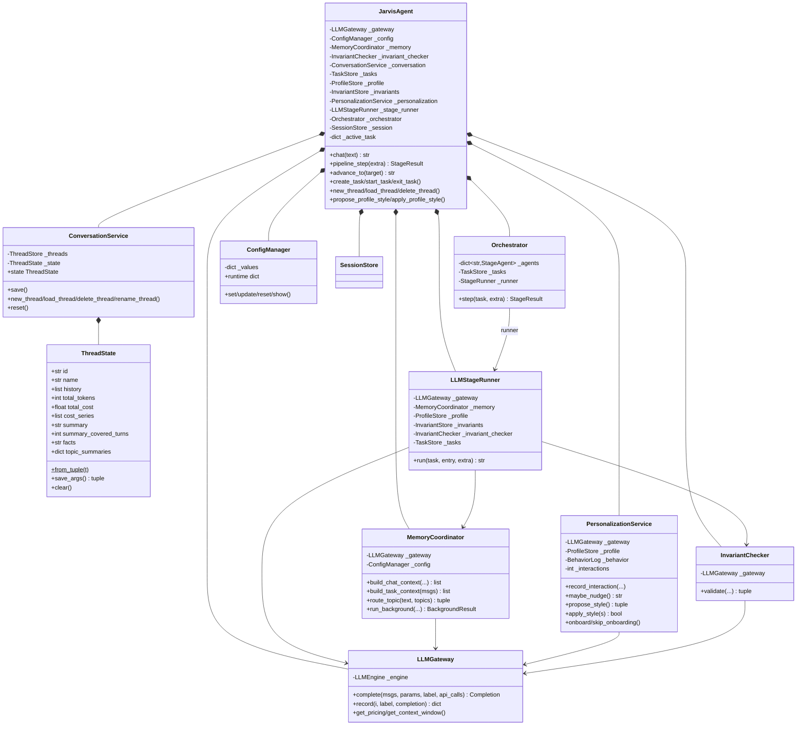
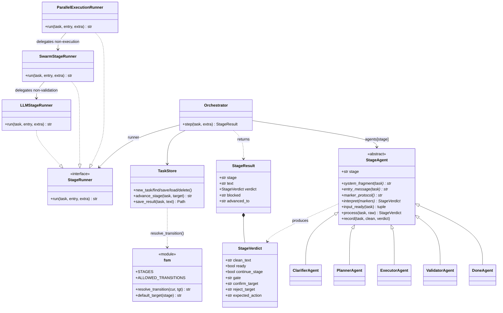
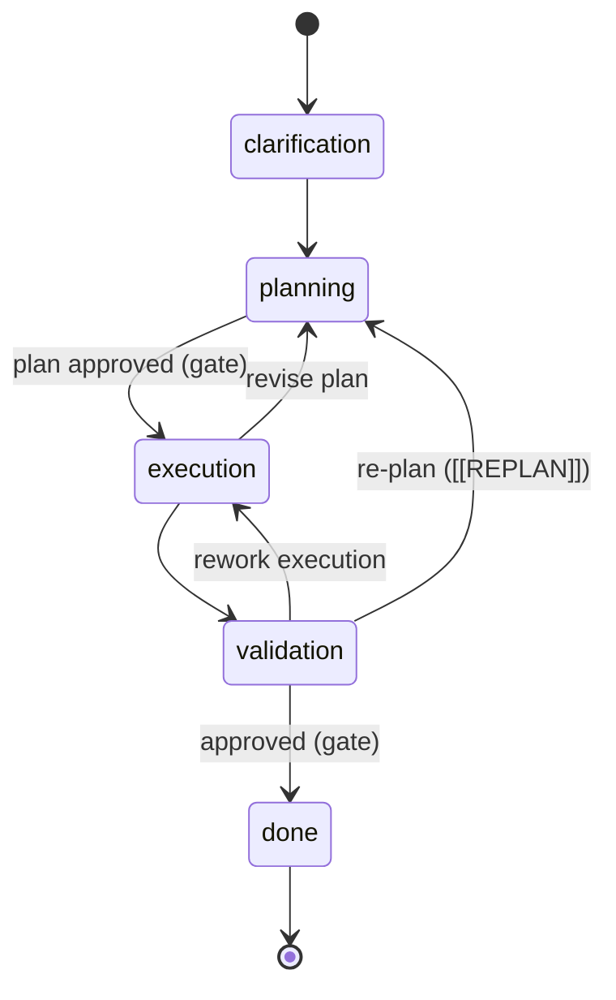
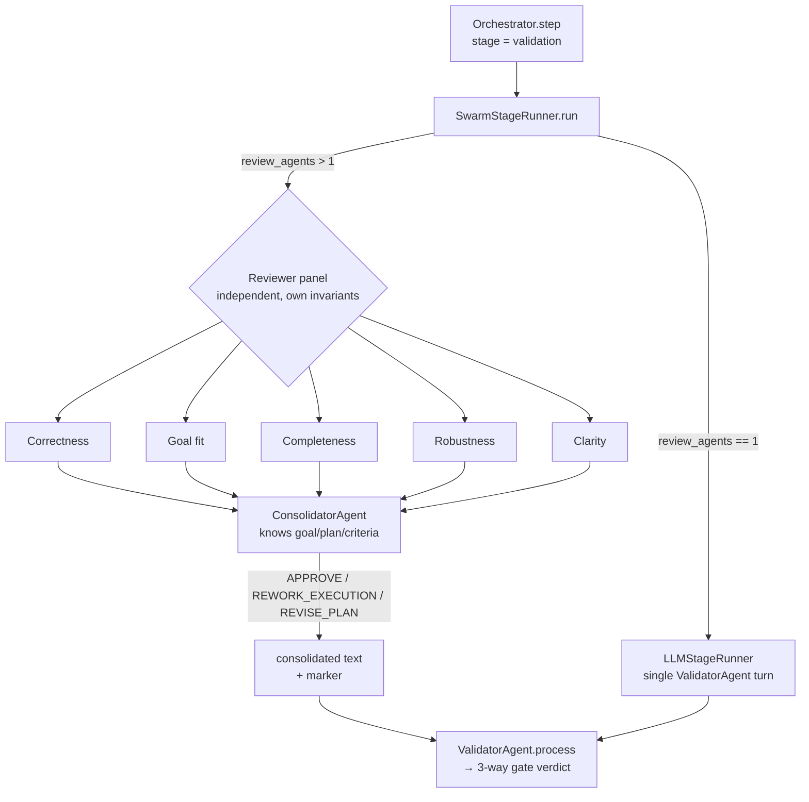
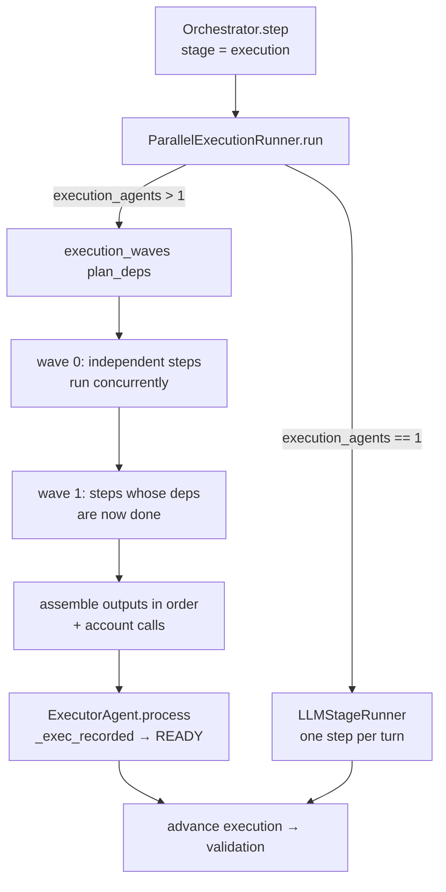
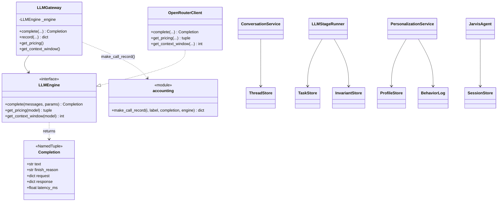
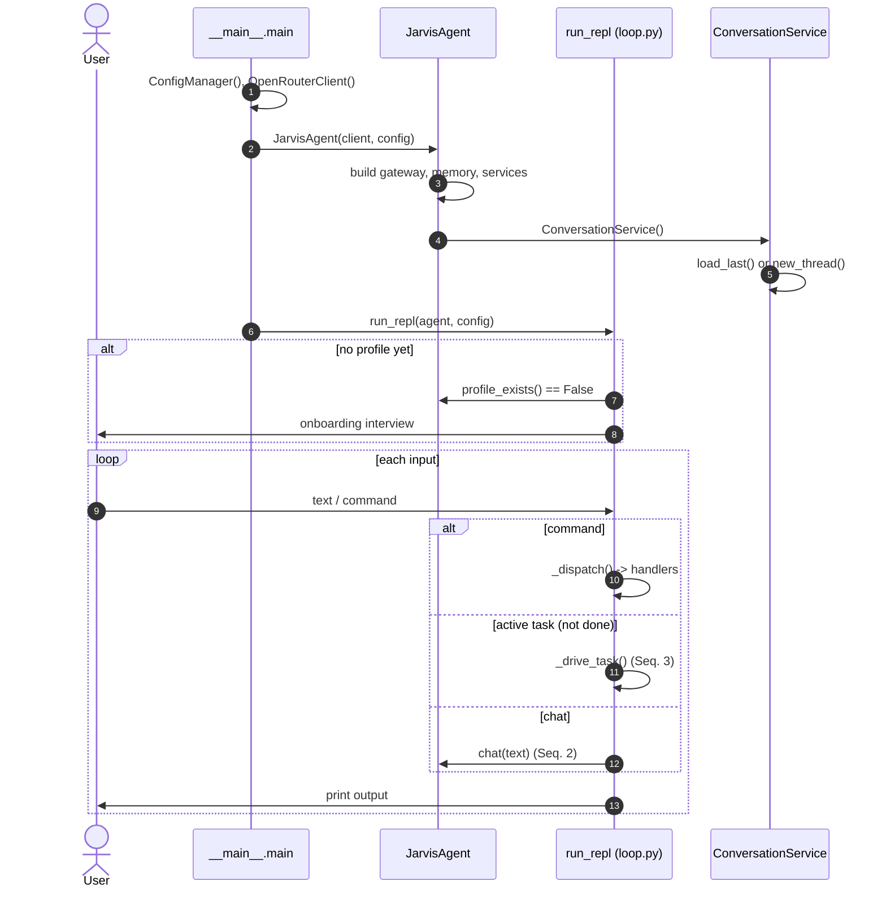
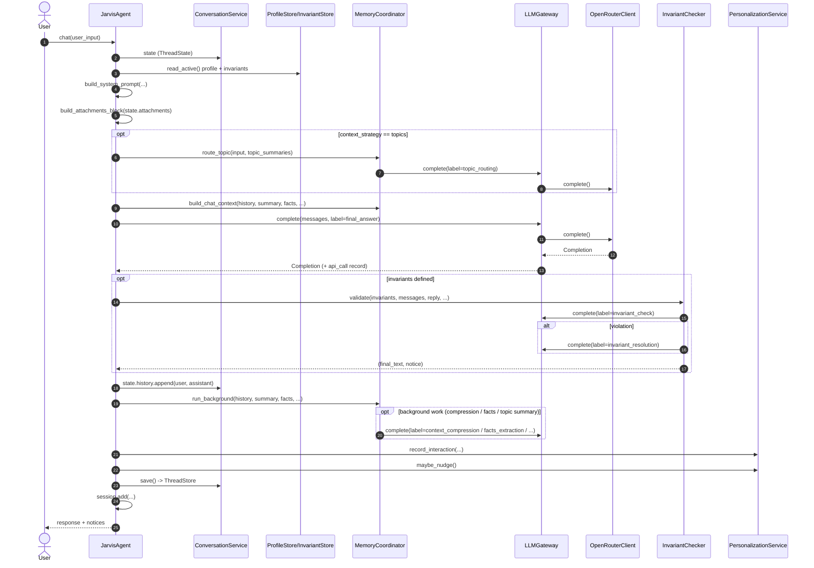
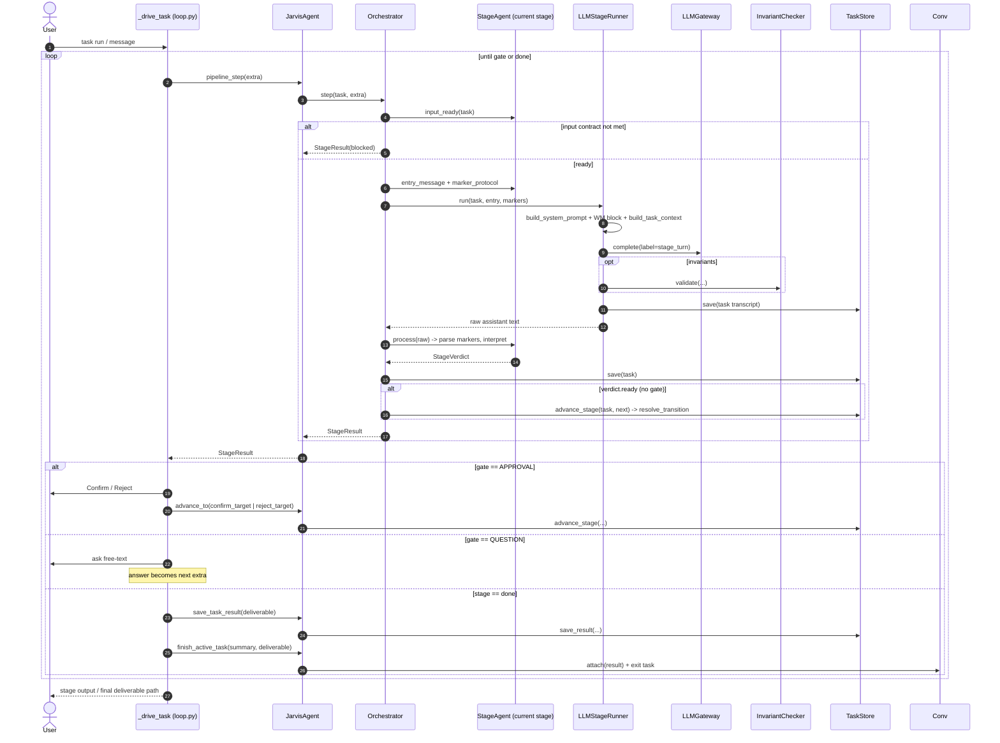

# Jarvis — Class & Sequence Diagrams (post-refactor)

Reflects the current code after the KB-alignment refactor: `JarvisAgent` as a thin
composition-root facade, `LLMGateway` as the single model chokepoint, the
`MemoryCoordinator` / `ConversationService` / `PersonalizationService` services,
and the `Orchestrator → StageRunner → StageAgent` task pipeline.

---

## Class Diagram 1 — Composition root & services

---

## Class Diagram 2 — Task pipeline & FSM

### FSM state diagram (code-enforced via `ALLOWED_TRANSITIONS`)

### Validation swarm (opt-in via `review_agents` > 1)

The `validation` stage can be run by a panel of reviewer agents instead of the
single `ValidatorAgent` turn. `SwarmStageRunner` sits on the same `StageRunner`
seam: for `validation` it fans the turn out to N independent reviewers, then a
consolidator agent (which knows the user's request) merges their opinions into one
decision; for every other stage it delegates to `LLMStageRunner` unchanged. The
reviewers never see each other's output — all opinions flow only through the
consolidator (no agent-to-agent comms). The consolidated text carries the existing
markers, so `ValidatorAgent` maps it onto the unchanged 3-way human gate
(`[[REPLAN]]` ⇒ "revise the plan" recommended). Cost is bounded: ~N+1 model calls
per validation turn, all through `LLMGateway` and all accounted onto the task.

### Parallel execution (opt-in via `execution_agents` > 1)

The `execution` stage can run its plan steps with a pool of executor agents instead
of one step per turn. `PlannerAgent` annotates each step with `[after: …]`, parsed
into a dependency graph (`plan_deps`). `ParallelExecutionRunner` (same `StageRunner`
seam) groups the steps into topological **waves** — every step in a wave has its
dependencies satisfied — and runs the steps *within* a wave concurrently, the waves
in order. Dependent steps receive their upstream steps' outputs. It assembles the
results, accounts every call, and emits `[[READY]]` so the orchestrator advances
`execution → validation` on the normal forward edge. Off (`execution_agents == 1`),
it delegates to the sequential per-step runner unchanged.

---

## Class Diagram 3 — LLM gateway, providers & repositories

---

## Sequence Diagram 1 — Startup & REPL input routing

---

## Sequence Diagram 2 — Chat turn (`agent.chat`)

---

## Sequence Diagram 3 — Task pipeline turn with gates (`task run`)

